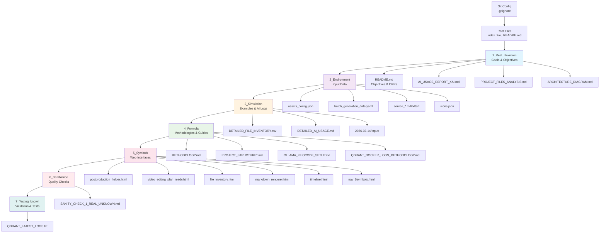

# Project Architecture Diagram

## Overview
This diagram represents the 7-phase architecture of the Video Post Production Helper project.

## Mermaid Diagram

## Architecture Explanation

### Flow Direction
The project follows a logical 7-phase progression from unknown problems to known solutions:

1. **1_Real_Unknown**: Define goals and objectives
2. **2_Environment**: Gather and organize input data
3. **3_Simulation**: Create examples and test scenarios
4. **4_Formula**: Develop methodologies and processes
5. **5_Symbols**: Implement working code and interfaces
6. **6_Semblance**: Perform quality checks and error handling
7. **7_Testing_known**: Validate and reach final proof

### Key Components
- **Root Level**: Entry points and general documentation
- **Data Flow**: Information moves from raw inputs to processed outputs
- **Quality Gates**: Each phase includes validation and documentation
- **AI Integration**: AI usage tracked throughout development

### File Organization
- Each phase contains relevant files for that development stage
- Shared components (like navigation) centralized where appropriate
- Documentation distributed across phases for context

*Diagram created on 2026-02-15*