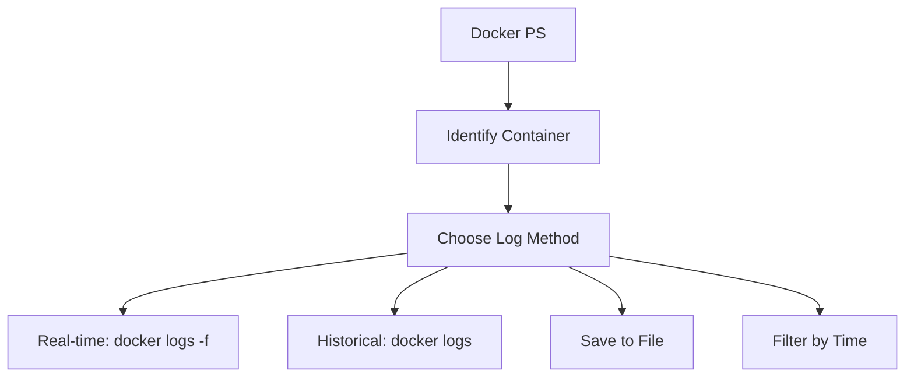

# Qdrant Docker Logs Methodology 🚀

This document outlines the steps to retrieve logs from Qdrant when running inside Docker for indexing purposes.

## Prerequisites 📋
- Docker installed and running 🐳
- Qdrant container running in Docker

## Steps 🛠️

1. **Identify the Qdrant container** 🔍
   - Run: `docker ps` to list running containers
   - Find the container name or ID for Qdrant (usually named something like `qdrant` or `qdrant-qdrant-1`)

2. **View logs in real-time** 📊
   - Run: `docker logs -f <container_name_or_id>`
   - This streams the logs continuously

3. **Get historical logs** 📜
   - Run: `docker logs <container_name_or_id>`
   - This shows all available logs

4. **Save logs to file** 💾
   - Run: `docker logs <container_name_or_id> > qdrant_logs.txt`
   - This saves logs to a file for analysis

5. **Filter logs by time** ⏰
   - Run: `docker logs --since "2023-01-01T00:00:00" <container_name_or_id>`
   - Adjust the timestamp as needed

## Troubleshooting 🔧
- If no logs appear, ensure the container is running
- Check Docker daemon status: `docker info`
- For persistent storage, mount a volume for logs

## Mermaid Diagram 📊

